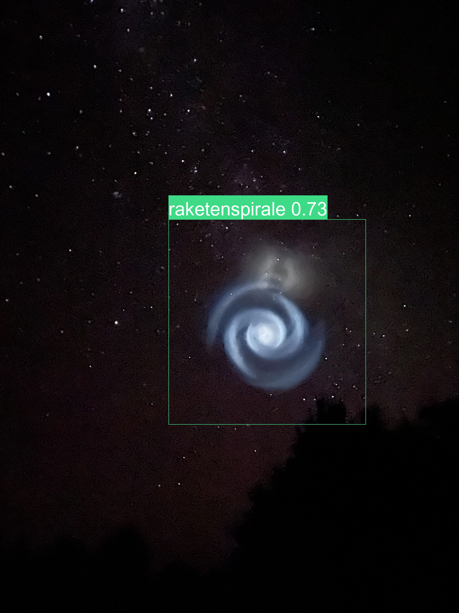

# UFO-Detector

Ein Datensatz der häufigsten Phänomene am Himmel oder in der Gegend des Himmels, die oft als UFO fehlinterpretiert werden im YoloV5-Format.

A dataset of the most common phenomenon that are (seemingly) seen in the sky that are most oft misinterpreted as UFO in the YoloV5-format.

Vielen Dank an Jörg N., die MUFON-CES, Ronalderich, Thomas G. und alle Anderen für die Mithilfe!

Thanks to Jörg N., the MUFON-CES , Ronalderich, Thomas G. and everyone else who helped!

# Usable models

See the models folder for pretrained Pytorch and TensorFlow.js-Models.
