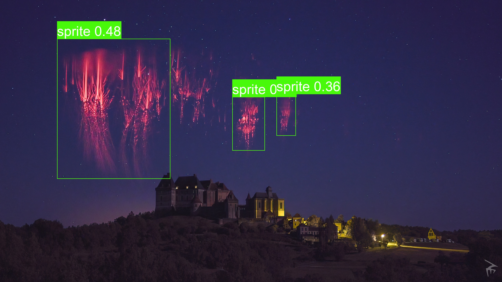
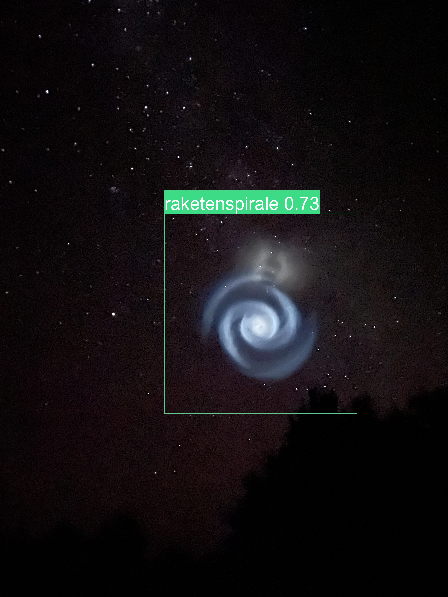

# What is this?

This is a pretrained PyTorch-Model based on YoloV5 that allows identifying most of the stuff that flies around in the skies that are often misinterpreted as UFOs.

Input: an Image (or video, depending on your implementation).

Output: List of Bounding Boxes, that is, a list of coordinates, categories it detects something as and how certain the network is that this category.





# How to prepare your environment

This guide is for Debian-Linux only. 

## Preparation

The following snippet will prepare your environment (install, Python, PyTorch, ...), so you can simply use this model:

```console
sudo apt-get install python3 python3-pip 
python3 -m pip install --upgrade pip
pip3 install virtualenv
python3 -m venv ~/.yolo_env
source ~/.yolo_env/bin/activate
git clone --depth 1 https://github.com/ultralytics/yolov5.git
cd yolov5
pip3 install -r requirements.txt
```

Now you can use `source ~/.yolo_env/bin/activate` to load this environment before loading the main script with `python3 example.py --img imagefile.jpg`.

## Explanation of the results

### `result.pandas().xywh[0]`:

```
       xcenter     ycenter       width      height  confidence  class    name
0   668.862244  626.564819  586.275146  768.257690    0.497301     45  sprite
1  1448.861938  710.136047  135.020264  298.230469    0.458381     45  sprite
2  1122.084961  520.964966  278.182434  440.907013    0.336716     45  sprite
```

Each line (except the first one) is one bounding box. The `xcenter` is the absolute position of the center on the X-Axis on the image, the ycenter the vertical center (see image). `width` and `height` are (obviously) the width and height of the bounding box. `confidence` is "how sure" the network is (see it as a score of similiarity to other images the network has been trained on in the same category). `class` is the number of the category, and `name` the name of the category.


(Source: https://github.com/ultralytics/yolov5/issues/2293)

## `result.pandas().xyxy[0].to_json()`:

```json
{
  "xmin": {
    "0": 375.7246398926,
    "1": 1381.3518066406,
    "2": 982.9937133789
  },
  "ymin": {
    "0": 242.4359588623,
    "1": 561.0208129883,
    "2": 300.5114440918
  },
  "xmax": {
    "0": 961.9998168945,
    "1": 1516.3720703125,
    "2": 1261.1761474609
  },
  "ymax": {
    "0": 1010.6936645508,
    "1": 859.2512817383,
    "2": 741.4184570312
  },
  "confidence": {
    "0": 0.4973013997,
    "1": 0.4583806396,
    "2": 0.3367164135
  },
  "class": {
    "0": 45,
    "1": 45,
    "2": 45
  },
  "name": {
    "0": "sprite",
    "1": "sprite",
    "2": "sprite"
  }
}
```

The `xyxy` does not return width and height, but `xmin`/`xmax` and `ymin`/`ymax`, each being the outer points of the bounding box. `class`, `confidence` and `name` are the same.

Each bounding box generates a new subkey in each associative array, named by it's number (sadly, as string by default).

# Continue

Feel free to play around with this and create from it whatever you want. But keep in mind that you have to show our disclaimer (see LICENSE in the root folder) if you publish them somehow.
